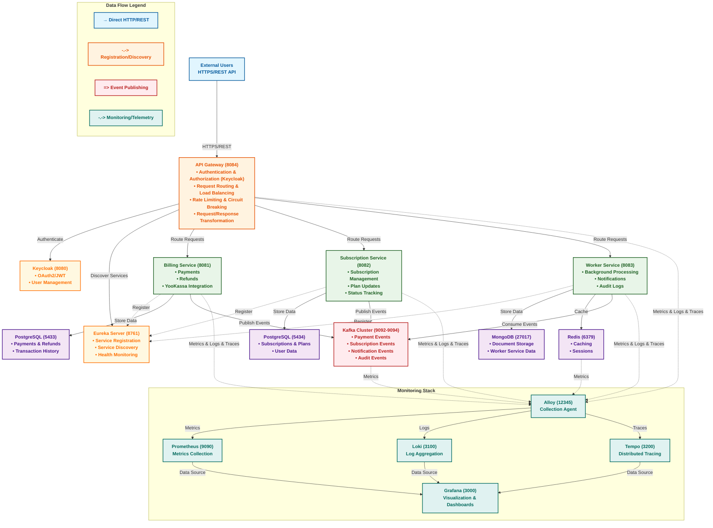

<!-- PROJECT LOGO -->
<br />
<div align="center">

<h3 align="center">SubEngine - Microservices Platform</h3>

  <p align="center">
    A comprehensive microservices ecosystem built with Spring Boot and modern cloud-native technologies
    <br />
    <br />
    <a href="https://github.com/sphinx46/sub-engine-project/issues/new?labels=bug">Report Bug</a>
    &nbsp;&nbsp;&nbsp;&nbsp;·&nbsp;&nbsp;&nbsp;&nbsp;
    <a href="https://github.com/sphinx46/sub-engine-project/issues/new?labels=enhancement">Request Feature</a>
  </p>
</div>

<!-- SKILL ICONS -->
<p align="center">
  
</p>

---

<!-- TABLE OF CONTENTS -->
<details>
  <summary>Table of Contents</summary>
  <ol>
    <li>
      <a href="#about-the-project">About The Project</a>
      <ul>
        <li><a href="#key-features">Key Features</a></li>
        <li><a href="#architecture-overview">Architecture Overview</a></li>
      </ul>
    </li>
    <li>
      <a href="#services-overview">Services Overview</a>
      <ul>
        <li><a href="#eureka-server">Eureka Server</a></li>
        <li><a href="#api-gateway">API Gateway</a></li>
        <li><a href="#billing-service">Billing Service</a></li>
        <li><a href="#subscription-service">Subscription Service</a></li>
        <li><a href="#worker-service">Worker Service</a></li>
      </ul>
    </li>
    <li>
      <a href="#technology-stack">Technology Stack</a>
      <ul>
        <li><a href="#backend">Backend</a></li>
        <li><a href="#infrastructure--monitoring">Infrastructure & Monitoring</a></li>
        <li><a href="#development--deployment">Development & Deployment</a></li>
      </ul>
    </li>
    <li>
      <a href="#getting-started">Getting Started</a>
      <ul>
        <li><a href="#prerequisites">Prerequisites</a></li>
        <li><a href="#installation">Installation</a></li>
        <li><a href="#running-the-application">Running the Application</a></li>
        <li><a href="#environment-configuration">Environment Configuration</a></li>
      </ul>
    </li>
    <li>
      <a href="#api-documentation">API Documentation</a>
      <ul>
        <li><a href="#service-endpoints">Service Endpoints</a></li>
        <li><a href="#detailed-api-endpoints">Detailed API Endpoints</a></li>
        <li><a href="#swagger-ui">Swagger UI</a></li>
      </ul>
    </li>
    <li>
      <a href="#monitoring--observability">Monitoring & Observability</a>
      <ul>
        <li><a href="#metrics">Metrics</a></li>
        <li><a href="#logging">Logging</a></li>
        <li><a href="#tracing">Tracing</a></li>
      </ul>
    </li>
    <li>
      <a href="#development">Development</a>
      <ul>
        <li><a href="#building">Building</a></li>
        <li><a href="#testing">Testing</a></li>
        <li><a href="#code-quality">Code Quality</a></li>
      </ul>
    </li>
    <li>
      <a href="#deployment">Deployment</a>
      <ul>
        <li><a href="#docker">Docker</a></li>
        <li><a href="#kubernetes-deployment">Kubernetes Deployment</a></li>
        <li><a href="#ci-cd">CI/CD</a></li>
      </ul>
    </li>
    <li><a href="#project-structure">Project Structure</a></li>
    <li><a href="#contributing">Contributing</a></li>
    <li><a href="#license">License</a></li>
    <li><a href="#contact">Contact</a></li>
  </ol>
</details>

---

## About The Project

**SubEngine** is a comprehensive microservices platform designed to demonstrate modern cloud-native application development using Spring Boot ecosystem. The project implements a service-oriented architecture with robust infrastructure components, monitoring, and observability features.

### Key Features:

- **Microservices Architecture** - Service discovery, API gateway, and distributed system patterns
- **Security** - OAuth2/JWT authentication with Keycloak integration
- **Observability** - Comprehensive monitoring with Prometheus, Grafana, Loki, and distributed tracing
- **Event-Driven** - Kafka-based asynchronous communication between services
- **Data Management** - PostgreSQL with Flyway migrations and MongoDB, Redis
- **Cloud-Native** - Docker containerization and Kubernetes deployment ready
- **Testing** - Comprehensive test suite with Testcontainers integration

## Technology Stack

### Backend
- **Java 21** - Modern Java with latest features
- **Spring Boot 3.4.3** - Application framework
- **Spring Cloud 2024.0.0** - Microservices framework
- **Spring Security** - Authentication and authorization
- **Spring Data JPA** - Database abstraction with Hibernate
- **Spring Kafka** - Event-driven communication
- **Spring Cloud Gateway** - API gateway
- **Spring Cloud Netflix Eureka** - Service discovery
- **Flyway** - Database migrations and version control

### Infrastructure & Monitoring
- **PostgreSQL 17** - Primary database
- **Redis 7** - Caching and session storage
- **Apache Kafka** - Event streaming platform
- **Keycloak** - Identity and access management
- **Prometheus** - Metrics collection
- **Grafana** - Metrics visualization and dashboards
- **Loki** - Log aggregation
- **Tempo** - Distributed tracing
- **Alloy** - Metrics and logs collection agent
- **MongoDB** - Document storage for worker service

### Development & Deployment
- **Docker & Docker Compose** - Containerization
- **Kubernetes** - Container orchestration
- **Maven** - Build and dependency management
- **Testcontainers** - Integration testing
- **JaCoCo** - Code coverage
- **GitHub Actions** - CI/CD pipeline
- **OpenAPI/Swagger** - API documentation

---

# SubEngine Architecture

## 🏗️ System Overview

SubEngine is a microservices-based platform for subscription management with integrated billing and notification services.

### Architecture Diagram



---

## Services Overview

### Eureka Server
**Port:** 8761  
**Description:** Service discovery server based on Netflix Eureka for microservice registration and discovery.

**Role in Ecosystem:**
The Eureka Server serves as the central registry for all microservices in the SubEngine platform. It maintains a real-time catalog of all available service instances, enabling service-to-service communication without hardcoded endpoints. This is fundamental to the microservices architecture, providing dynamic service discovery and load balancing capabilities.

**Key Features:**
- Service registration and discovery with health monitoring
- Automatic service instance registration and deregistration
- Load balancing support through client-side discovery
- Self-preservation mode to prevent cascading failures
- Dashboard for monitoring registered services
- Metadata management for service instances

**Workflow Integration:**
1. All microservices register with Eureka on startup
2. API Gateway discovers service locations through Eureka
3. Services periodically send heartbeats to maintain registration
4. Failed instances are automatically removed from registry
5. Clients can query Eureka to discover available service endpoints

**Endpoints:**
- `GET /eureka/` - Eureka dashboard showing all registered services
- `GET /eureka/apps` - List all registered applications with instance details
- `POST /eureka/apps/{appName}` - Register new application instance
- `DELETE /eureka/apps/{appName}/{instanceId}` - Deregister application instance
- `GET /actuator/health` - Health check endpoint
- `GET /actuator/info` - Application information and metadata

### API Gateway
**Port:** 8084  
**Description:** Central entry point for all client requests with routing, security, and cross-cutting concerns.

**Role in Ecosystem:**
The API Gateway serves as the single entry point for all external client interactions with the SubEngine platform. It provides a unified interface that routes requests to appropriate microservices, handles authentication/authorization, implements cross-cutting concerns like rate limiting and circuit breaking, and shields internal services from direct external access. This pattern enhances security, simplifies client integration, and enables centralized control of the API surface.

**Key Features:**
- Request routing and load balancing across multiple service instances
- OAuth2/JWT authentication and authorization using Keycloak
- Rate limiting to prevent abuse and ensure fair usage
- Circuit breaking to prevent cascading failures
- Request/response transformation and enrichment
- Redis-based caching for improved performance
- Distributed tracing with Zipkin for request flow monitoring
- API versioning and backward compatibility

**Workflow Integration:**
1. External clients authenticate through Keycloak via API Gateway
2. Gateway validates tokens and applies security policies
3. Requests are routed to appropriate backend services based on path patterns
4. Service discovery happens through Eureka integration
5. Responses are aggregated, transformed, and cached when appropriate
6. Failed requests trigger circuit breakers to protect downstream services
7. All requests are logged and traced for observability
8. API documentation is available through Swagger UI for developer reference

**Endpoints:**
- `GET /actuator/health` - Health check endpoint
- `GET /actuator/metrics` - Application metrics for monitoring
- `GET /actuator/prometheus` - Prometheus metrics endpoint
- `GET /swagger-ui.html` - Interactive API documentation
- `GET /api/billing/*` - Route to billing service
- `GET /api/subscriptions/*` - Route to subscription service
- `GET /api/workers/*` - Route to worker service
- `POST /api/auth/login` - Authentication endpoint
- `POST /api/auth/refresh` - Token refresh endpoint

### Billing Service
**Port:** 8081  
**Description:** Handles payment processing, billing operations, and financial transactions.

**Role in Ecosystem:**
The Billing Service is the financial core of the SubEngine platform, responsible for processing all monetary transactions and payment operations. It integrates with YooKassa payment gateway to handle real payments, maintains transaction records, manages refunds, and publishes payment events to Kafka for notification purposes. This service ensures financial data integrity, compliance with payment standards, and provides audit trails for all financial operations.

**Key Features:**
- Payment processing with YooKassa integration for multiple payment methods
- Invoice management and generation
- Comprehensive transaction history and reporting
- Refund processing with automatic calculation
- Kafka event publishing for real-time notifications
- PostgreSQL data persistence with Flyway migrations
- Webhook handling for payment status updates
- Multi-currency support and conversion rates

**Workflow Integration:**
1. Payment requests are routed through API Gateway to Billing Service
2. Service validates payment data and creates payment records in PostgreSQL
3. Payment requests are sent to YooKassa for processing
4. YooKassa processes payment and sends webhook notifications
5. Billing Service updates payment status based on webhook callbacks
6. Payment events are published to Kafka for other services to consume
7. Worker Service consumes payment events to send notifications
8. Refunds are processed with automatic status updates
9. All financial operations are audited and logged for compliance

**Endpoints:**
- `POST /api/billing/payments` - Create new payment
- `GET /api/billing/payments/{paymentId}` - Get payment by ID
- `GET /api/billing/payments` - Get user payments with pagination
- `POST /api/billing/payments/{paymentId}/capture` - Capture authorized payment
- `POST /api/billing/payments/{paymentId}/cancel` - Cancel payment
- `GET /api/billing/payments/yookassa/{paymentId}` - Get payment status from YooKassa
- `POST /api/billing/refunds` - Create refund for payment
- `GET /api/billing/refunds/{refundId}` - Get refund by ID
- `GET /api/billing/payments/{paymentId}/refunds` - Get refunds for specific payment
- `GET /api/billing/refunds` - Get user refunds with pagination
- `POST /api/billing/webhook/yookassa` - YooKassa payment status webhook
- `GET /actuator/health` - Health check
- `GET /actuator/metrics` - Application metrics

### Subscription Service
**Port:** 8082  
**Description:** Manages user subscriptions, plans, and lifecycle operations.

**Role in Ecosystem:**
The Subscription Service manages the complete subscription lifecycle for the SubEngine platform. It handles subscription plan definitions, user subscription creation and management, billing integration, and automated renewals. This service works closely with the Billing Service to process payments and with the Worker Service to send subscription-related notifications. It ensures proper subscription state management and provides business intelligence on subscription metrics and user engagement.

**Key Features:**
- Comprehensive subscription plan management with pricing tiers
- User subscription lifecycle management (create, update, cancel, renew)
- Redis caching for high-performance subscription lookups
- Kafka event handling for real-time subscription updates
- PostgreSQL data storage with full audit history
- Integration with Billing Service for payment processing
- Automated subscription renewals and expiration handling
- Subscription analytics and reporting capabilities

**Workflow Integration:**
1. Users browse available subscription plans through API Gateway
2. Subscription requests are routed to Subscription Service
3. Service creates subscription records and integrates with Billing Service
4. Payment is processed through Billing Service and status is updated
5. Subscription events are published to Kafka for other services
6. Worker Service consumes events to send confirmation notifications
7. Subscription status changes trigger appropriate actions (renewals, cancellations)
8. Redis cache is updated for fast subscription status retrieval
9. All subscription operations are audited and stored in PostgreSQL

**Endpoints:**
- `POST /api/subscriptions` - Create new subscription
- `GET /api/subscriptions/{userId}` - Get user subscriptions with pagination
- `GET /api/subscriptions/{userId}/status/{status}` - Get subscriptions by status
- `PATCH /api/subscriptions/{subscriptionId}/cancel` - Cancel subscription
- `GET /api/subscriptions/{userId}/active/count` - Count active subscriptions
- `PATCH /api/subscriptions/{subscriptionId}/plan` - Update subscription plan
- `GET /api/subscriptions/plans` - List available subscription plans
- `GET /actuator/health` - Health check
- `GET /actuator/metrics` - Application metrics

### Worker Service
**Port:** 8083  
**Description:** Background processing service for asynchronous tasks and job execution.

**Role in Ecosystem:**
The Worker Service serves as the asynchronous processing backbone of the SubEngine platform. It handles background jobs, manages notifications across multiple channels (email, SMS, push), maintains comprehensive audit logs, and processes events from other services. This service enables the platform to perform time-consuming operations without blocking user interactions, ensures reliable delivery of notifications, and provides detailed audit trails for compliance and debugging.

**Key Features:**
- Asynchronous task processing with job scheduling and management
- Multi-channel notification system (email, SMS, push notifications)
- Comprehensive audit logging for all platform activities
- Event-driven architecture consuming Kafka topics
- MongoDB document storage for flexible data structures
- Background job retry mechanisms and error handling
- Notification template management and personalization
- Integration with external services (email providers, SMS gateways)

**Workflow Integration:**
1. Other services publish events to Kafka (payments, subscriptions, user actions)
2. Worker Service consumes relevant events from Kafka topics
3. Background jobs are scheduled and executed asynchronously
4. Notifications are generated and sent through appropriate channels
5. Audit logs are created for all significant system events
6. Job status and execution history are maintained in MongoDB
7. Failed jobs are automatically retried with exponential backoff
8. System metrics and health status are reported to monitoring stack
9. All activities are correlated with trace IDs for end-to-end tracking

**Endpoints:**
- `GET /actuator/health` - Health check
- `GET /actuator/metrics` - Application metrics

**Note:** Worker Service is primarily a background processing service that consumes Kafka events and does not expose REST endpoints for external API calls. It operates through:
- Event-driven architecture consuming Kafka topics
- Scheduled background jobs with internal management
- Internal notification processing through various channels
- Audit logging for compliance and debugging

---

## API Documentation (Swagger)

Each microservice provides comprehensive API documentation through Swagger UI, enabling developers to explore and test endpoints interactively.

**Available Swagger Documentation:**
- **API Gateway:** `http://localhost:8084/swagger-ui.html` - Central API documentation with routing information
- **Billing Service:** `http://localhost:8081/swagger-ui.html` - Payment processing and billing endpoints
- **Subscription Service:** `http://localhost:8082/swagger-ui.html` - Subscription management endpoints  
- **Worker Service:** `http://localhost:8083/swagger-ui.html` - Background processing and notification endpoints

**Swagger Features:**
- Interactive API exploration with live testing capabilities
- Comprehensive request/response schemas and examples
- Authentication testing with OAuth2/JWT tokens
- API versioning support and backward compatibility information
- Downloadable OpenAPI specifications for client integration

---

## Getting Started

### Prerequisites

Before you begin, ensure you have the following installed:

- **Java 21** or higher
- **Maven 3.8+**
- **Docker** and **Docker Compose**
- **Git**
- **Optional:** **kubectl** for Kubernetes deployment

**Verify versions:**
```bash
java --version
mvn --version
docker --version
docker-compose --version
```

### Installation

1. **Clone the repository:**
   ```bash
   git clone https://github.com/sphinx46/sub-engine-project.git
   cd sub-engine-project
   ```

2. **Create environment configuration:**
   ```bash
   cp .env.example .env.dev
   # Edit .env.dev with your configuration
   ```

3. **Build the project:**
   ```bash
   mvn clean install -DskipTests
   ```

### Running the Application

#### Option A: Docker Compose (Recommended)

```bash
# Start all services
docker-compose -f infra/docker/docker-compose-dev.yml up -d

# View logs
docker-compose -f infra/docker/docker-compose-dev.yml logs -f

# Stop services
docker-compose -f infra/docker/docker-compose-dev.yml down
```

#### Option B: Local Development

1. **Build Docker images:**
   ```bash
   # Build all services
   mvn clean install
   docker build -t sub-engine/eureka-server ./services/eureka-server
   docker build -t sub-engine/api-gateway ./services/api-gateway
   docker build -t sub-engine/billing-service ./services/billing-service
   docker build -t sub-engine/subscription-service ./services/subscription-service
   docker build -t sub-engine/worker-service ./services/worker-service
   ```

2. **Start infrastructure services:**
   ```bash
   docker-compose -f infra/docker/docker-compose-dev.yml up -d postgres redis kafka keycloak
   ```

3. **Run services individually:**
   ```bash
   # Eureka Server
   cd services/eureka-server
   mvn spring-boot:run

   # API Gateway (new terminal)
   cd services/api-gateway
   mvn spring-boot:run

   # Billing Service (new terminal)
   cd services/billing-service
   mvn spring-boot:run

   # Subscription Service (new terminal)
   cd services/subscription-service
   mvn spring-boot:run

   # Worker Service (new terminal)
   cd services/worker-service
   mvn spring-boot:run
   ```

### Environment Configuration

The project uses `.env.example` as a template for environment configuration. Copy it to `.env.dev` and customize for your environment.

**Key configuration sections:**
- **Service Ports** - Define ports for each microservice  
- **Database Credentials** - PostgreSQL and MongoDB credentials
- **Keycloak Settings** - Authentication configuration
- **Kafka Configuration** - Event streaming settings
- **Monitoring Ports** - Prometheus, Grafana, and other tools
- **External Services** - YooKassa, email, and webhook URLs

**Setup:**
```bash
cp .env.example .env.dev
# Edit .env.dev with your specific values
```

---

## Monitoring & Observability

### Collection Agent (Alloy)

**Alloy:** `http://localhost:12345`

Alloy serves as the central collection agent that gathers metrics, logs, and traces from all services in the platform. It acts as a unified data pipeline that:

- **Collects metrics** from all microservices via Prometheus endpoints
- **Aggregates logs** from services and forwards them to Loki
- **Receives traces** from distributed tracing systems and sends them to Tempo
- **Performs data transformation** and enrichment before forwarding to backend systems
- **Provides service discovery** for monitoring targets
- **Handles data buffering** and ensures reliable delivery

### Metrics

**Prometheus:** `http://localhost:9090`

Collects metrics from all services:
- HTTP request metrics
- JVM performance metrics
- Database connection pools
- Kafka consumer/producer metrics
- Custom business metrics

**Key Metrics:**
- `http_server_requests_seconds_*` - HTTP request duration
- `jvm_memory_used_bytes` - JVM memory usage
- `process_cpu_seconds_total` - CPU usage
- `database_connections_active` - Active DB connections

### Logging

**Loki:** `http://localhost:3100`

Centralized log aggregation with:
- Structured JSON logging
- Service-level log separation
- Correlation IDs for request tracing
- Log retention policies

**Access logs in Grafana:** `http://localhost:3000` (Explore → Loki)

### Tracing

**Tempo:** `http://localhost:3200`

Distributed tracing with:
- Request flow across services
- Performance bottleneck identification
- Service dependency mapping
- Error tracking and debugging

**View traces in Grafana:** `http://localhost:3000` (Explore → Tempo)

---

## Development

### Building

```bash
# Build entire project
mvn clean install

# Build specific service
cd services/billing-service
mvn clean install

# Build with Docker
mvn clean install -Pdocker
```

### Testing

```bash
# Run all tests
mvn test

# Run tests for specific service
cd services/billing-service
mvn test

# Run integration tests with Testcontainers
mvn test -Pintegration-test

# Generate test coverage report
mvn jacoco:report
```

**Testing Stack:**
- **JUnit 5** - Unit testing framework
- **Testcontainers** - Integration testing with real containers
- **MockMvc** - Spring MVC testing
- **Spring Security Test** - Security testing
- **Testcontainers Kafka** - Kafka integration testing

### Code Quality

```bash
# Run code quality checks
mvn clean verify

# Generate JaCoCo coverage report
mvn jacoco:report

# Check for vulnerabilities
mvn dependency-check:check
```

**Quality Tools:**
- **JaCoCo** - Code coverage
- **SpotBugs** - Static code analysis
- **Checkstyle** - Code style enforcement
- **Dependency Check** - Vulnerability scanning

---

## Deployment

### Docker

**Build all services:**
```bash
mvn clean install -Pdocker
```

**Deploy with Docker Compose:**
```bash
# Development environment
docker-compose -f infra/docker/docker-compose-dev.yml up -d

# Note: Production deployment should use Kubernetes with proper configuration
# See Kubernetes deployment section for production setup
```

### Kubernetes Deployment

The project includes comprehensive Kubernetes configurations in `infra/k8s/` directory for production deployment.

#### Prerequisites
- **Kubernetes cluster** (v1.25+)
- **kubectl** configured with cluster access
- **Docker** for building images
- **Minikube** (for local development)

#### Deployment Components

**1. Namespace and Configuration:**
```yaml
# infra/k8s/deployment.yaml
apiVersion: v1
kind: Namespace
metadata:
  name: sub-engine
```

**2. Database Deployments:**
- **PostgreSQL instances** for billing, subscription, and keycloak services
- **MongoDB** for worker service
- **Redis** for caching and sessions
- **PersistentVolumeClaims** for data persistence
- **ConfigMaps** for Keycloak realm configuration

**3. Application Services:**
- **Eureka Server** - Service discovery
- **API Gateway** - Request routing and authentication
- **Billing Service** - Payment processing
- **Subscription Service** - Subscription management
- **Worker Service** - Background processing

**4. Infrastructure Services:**
- **Keycloak** - Identity and access management
- **Kafka Cluster** - Event streaming (KRaft mode)
- **MailDev** - Email testing service

#### Deployment Steps

**1. Prepare Environment:**
```bash
# Create namespace (if not already created by deployment.yaml)
kubectl create namespace sub-engine --dry-run=client -o yaml | kubectl apply -f -

# Apply secrets (create from .env.example)
kubectl apply -f infra/k8s/external-secrets.yaml
```

**2. Deploy All Services:**
```bash
# Deploy all services at once
cat infra/k8s/deployment.yaml | kubectl apply -f -

# Or deploy specific components:
# Deploy databases and infrastructure first
kubectl apply -f infra/k8s/deployment.yaml | grep -E '(StatefulSet|Deployment|Service)' | kubectl apply -f -

# Wait for databases to be ready
kubectl wait --for=condition=ready pod -l app=kafka -n sub-engine --timeout=300s
kubectl wait --for=condition=ready pod -l app=redis -n sub-engine --timeout=300s
kubectl wait --for=condition=ready pod -l app=mongodb -n sub-engine --timeout=300s
```

**3. Deploy Applications:**
```bash
# Deploy microservices (already included in step 2)
# All services are deployed from the single deployment.yaml file

# Wait for services to be ready
kubectl wait --for=condition=available deployment -n sub-engine --timeout=300s

# Check pod status
kubectl get pods -n sub-engine
```

**Alternative: Build and Load Script**
```bash
# For Minikube development - automated build and load
./infra/scripts/build-and-load.sh
```
This script automates the complete build and deployment process for Minikube:
- Checks and starts Minikube if needed
- Builds all microservices (Maven/Gradle)
- Creates Docker images for all services
- Loads infrastructure images into Minikube
- Verifies all images are loaded
- Ready for deployment with kubectl apply commands

**4. Access Services:**
```bash
# Get service URLs
minikube service list -n sub-engine

# Access specific services
minikube service api-gateway -n sub-engine --url
minikube service keycloak -n sub-engine --url
```

**Note:** Services are exposed as NodePort or ClusterIP. For external access, use `minikube service` or configure port forwarding.
```bash
# Port forwarding example
kubectl port-forward svc/api-gateway 8084:8084 -n sub-engine
```

#### External Secrets Management

For comprehensive AWS Secrets Manager setup and integration with Kubernetes, see the detailed documentation in `infra/k8s/documentation/aws-secrets-setup.md`.

This guide provides:
- Step-by-step AWS Secrets Manager configuration
- External Secrets Operator setup
- Secret synchronization procedures
- Security best practices
- Troubleshooting and cost optimization

**Quick Setup:**
```bash
# Apply secrets configuration
kubectl apply -f infra/k8s/external-secrets.yaml
```

#### Monitoring and Scaling

**Horizontal Pod Autoscaling:**
```yaml
apiVersion: autoscaling/v2
kind: HorizontalPodAutoscaler
metadata:
  name: billing-service-hpa
  namespace: sub-engine
spec:
  scaleTargetRef:
    apiVersion: apps/v1
    kind: Deployment
    name: billing-service
  minReplicas: 2
  maxReplicas: 10
  metrics:
  - type: Resource
    resource:
      name: cpu
      target:
        type: Utilization
        averageUtilization: 70
  - type: Resource
    resource:
      name: memory
      target:
        type: Utilization
        averageUtilization: 80
```

**Health Checks and Monitoring:**
- **Liveness probes** configured for all services
- **Readiness probes** for service availability
- **Health endpoints** at `/actuator/health` for all Spring Boot services
- **Service discovery** through Eureka dashboard
- **Manual monitoring** through kubectl and service logs
```bash
# Check service health
kubectl get pods -n sub-engine
kubectl logs -f deployment/billing-service -n sub-engine
# Access Eureka dashboard
minikube service eureka-server -n sub-engine --url
```

#### Backup and Recovery

**Database Backups:**
- Automated PostgreSQL backups using pg_dump
- MongoDB backups using mongodump
- Cloud storage integration (AWS S3, Google Cloud Storage)
- Point-in-time recovery capability

**Disaster Recovery:**
- Multi-zone deployment
- Database replication
- Service failover mechanisms
- Data restoration procedures

### CI/CD

**GitHub Actions Workflow:**

**Triggers:**
1. Push to main/develop branches
2. Pull request creation and updates
3. Manual workflow dispatch for specific scenarios

**Pipeline Stages:**
1. Code checkout and environment setup
2. Unit tests execution for all services
3. Integration tests with Testcontainers
4. Code quality and static analysis checks
5. Docker image building and tagging
6. Security vulnerability scanning
7. Deployment to staging and production environments

**Pipeline Features:**
1. Parallel test execution across multiple services
2. Matrix builds for different Java versions and profiles
3. Automated dependency updates and security patches
4. Comprehensive security vulnerability scanning
5. Automated rollback mechanisms on deployment failures
6. Performance testing and regression analysis
7. Documentation generation and deployment

---

## 📁 Project Structure

```
sub-engine-project/
├── services/                          # Microservices
│   ├── eureka-server/                # Service discovery
│   │   ├── src/main/java/
│   │   ├── src/main/resources/
│   │   ├── Dockerfile
│   │   └── pom.xml
│   ├── api-gateway/                  # API Gateway
│   │   ├── src/main/java/
│   │   ├── src/main/resources/
│   │   ├── Dockerfile
│   │   └── pom.xml
│   ├── billing-service/              # Payment processing
│   │   ├── src/main/java/
│   │   ├── src/main/resources/
│   │   ├── Dockerfile
│   │   └── pom.xml
│   ├── subscription-service/         # Subscription management
│   │   ├── src/main/java/
│   │   ├── src/main/resources/
│   │   ├── Dockerfile
│   │   └── pom.xml
│   └── worker-service/               # Background processing
│       ├── src/main/java/
│       ├── src/main/resources/
│       ├── Dockerfile
│       └── pom.xml
├── infra/                            # Infrastructure configuration
│   ├── docker/                       # Docker Compose files
│   │   └── docker-compose-dev.yml
│   ├── k8s/                          # Kubernetes manifests
│   │   ├── deployment.yaml
│   │   └── external-secrets.yaml
│   ├── grafana/                      # Grafana dashboards
│   │   ├── dashboards/
│   │   └── provisioning/
│   ├── prometheus/                   # Prometheus configuration
│   ├── loki/                         # Loki configuration
│   ├── tempo/                        # Tempo configuration
│   └── alloy/                        # Alloy configuration
├── .github/                          # GitHub Actions
│   └── workflows/
│       └── workflow.yml
├── pom.xml                           # Parent POM
├── Dockerfile                        # Root Dockerfile
├── mvnw                              # Maven wrapper
├── mvnw.cmd                          # Maven wrapper (Windows)
└── README.md                         # This file
```

---

## 🤝 Contributing

Contributions are what make the open-source community such an amazing place to learn, inspire, and create. Any contributions you make are **greatly appreciated**.

### 📝 Development Workflow

1. **Fork the Project**
2. **Create your Feature Branch** (`git checkout -b feature/AmazingFeature`)
3. **Commit your Changes** (`git commit -m 'Add some AmazingFeature'`)
4. **Push to the Branch** (`git push origin feature/AmazingFeature`)
5. **Open a Pull Request**

### 📋 Coding Standards

- Follow **Spring Boot conventions**
- Use **meaningful commit messages**
- Write **unit tests** for new features
- Update **documentation** as needed
- Follow **clean code principles**

### 🧪 Testing Requirements

- All new features must have **unit tests**
- Integration tests for **cross-service functionality**
- Minimum **80% code coverage**
- All tests must pass before merging

---

## 📄 License

This project is licensed under the MIT License. See the [LICENSE](LICENSE) file for details.

---

## 📞 Contact

- **Project Repository:** [https://github.com/sphinx46/sub-engine-project](https://github.com/sphinx46/sub-engine-project)
- **Issues:** [Report Issues](https://github.com/sphinx46/sub-engine-project/issues)
- **Discussions:** [GitHub Discussions](https://github.com/sphinx46/sub-engine-project/discussions)

---

<div align="center">

**Built with ❤️ using Spring Boot and modern cloud-native technologies**

[⬆ Back to Top](#-subengine---microservices-platform)

</div>
